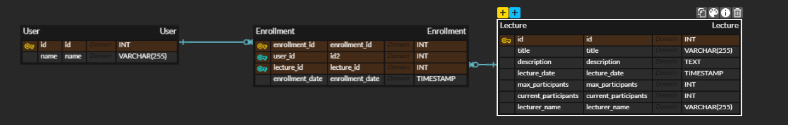

## ERD 설계

### User 테이블:

- 특강 신청 시스템에서 각 사용자가 강의에 신청하기 때문에, 사용자 테이블 추가.

### Lecture 테이블:

- 강의가 개설되고, 사용자가 해당 강의에 등록하기 때문에 강의 테이블 추가.

### Enrollment 테이블:

사용자가 강의에 신청한 기록을 저장.
이 테이블은 User 테이블과 Lecture 테이블 사이의 관계 테이블 역할.

- 중복 신청 방지: 이 구조를 통해, Enrollment 테이블의 user_id와 lecture_id로 복합키를 설정할 수 있습니다. 이를 통해 동일 사용자가 동일 강의에 여러 번 신청하는 것을 방지할 수 있습니다.

- 강의 인원 관리: Lecture 테이블에서 max_participants와 current_participants를 관리함으로써, 최대 수강 인원을 초과하지 않도록 제어할 수 있습니다.
